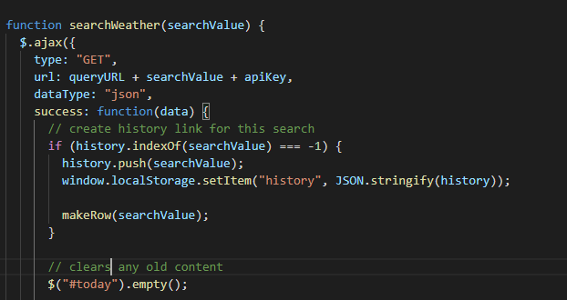
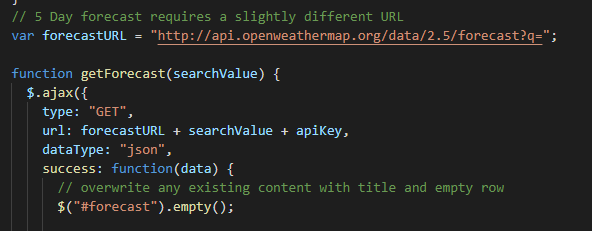
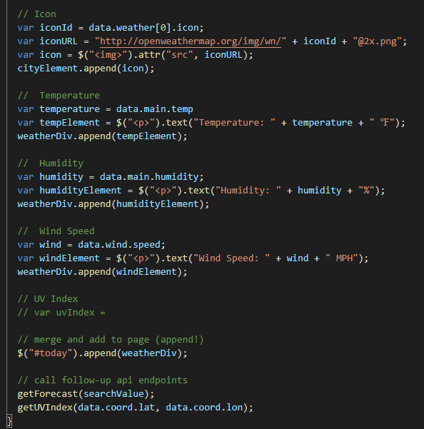
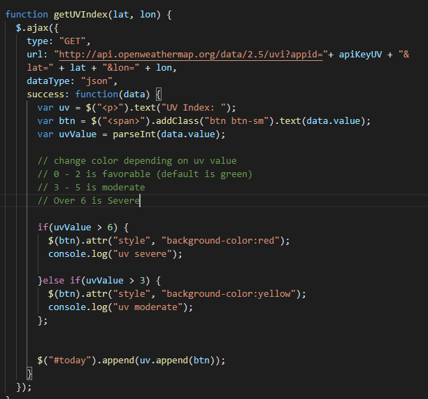

Link: https://fatmoogle.github.io/Weather-Dashboard

# Weather-Dashboard

Link: https://fatmoogle.github.io/Weather-Dashboard

Weather application that allows user to search for the current and 5 day forecast of a city.

This was a project designed to get used to navigating and using an API while updating the page with specific results. This project used the OpenWeather API. 

### AJAX Calls

Using AJAX, you are able to grab the data stored within the OpenWeather API using the "GET" method, and using an API Key which was assigned to us when we signed up on the website. In order for this application to function well, we need to have the prior city be replaced by the newest user search. So if the user searches for Asheville, it would replace the current city and not just append to it.

We also needed to do this for the five day forecast and not just the current day weather. This required changing the URL search parameter from "weather" to "forecast".

Following the same method, we also added the .empty function to get rid of any previous forecast information.

### Creating HTML on the fly

In order to get the information to appear on the webpage, we need to have elements created that would then house the information we retrieved from the API. To do this I created a div to store everything, followed by variables that house the needed information (temperature, humidity, date, etc). Then you can simply append the created elements to the div, and then append the div to the appropriate html element to display on the page.

### UV Index

To get the UV index to work, the url again required some tweaking. Once that was working properly, I created an if statement that would change the color based on the value of the UV index. If the UV index is considered severe it will be red. If it was considered moderate then the jquery selector will change it to yellow. But by default it will be green, which is a UV value of less than 3. It then gets appended to the current day weather information. 

Overall the assignment was a good delve into the world of third party APIs. The project also gave me a little bit of freedom to customize things to my liking as to get experience with animations and transition effects, such as the cards opacity changing as city is searched for.
